# Sony Vaio VGN-NS240E Hackintosh

## ⚠ MacOS X Supported
- Mac OS X: 
  - Snow Leopard ✅
  - Lion ✅
  - Mountain Lion ✅
  - Mavericks ✅
  - Yosemite ✅ (No QE/CI)
- Bootloader: Chameleon Bootloader

## ℹ️ System Infomation
* Original
  * CPU: Intel(R) Core(TM) 2 Duo CPU T6400 2.00GHz
  * GPU: Mobile Intel(R) 4 Series Express Chipset Family (Intel GM45)
  * Ram: 3GB DDR2 800MHz
  * Hard Disk: SamSung HDD 5400RPM SATA
  * Display: Widescreen TFT-LCD with XBRITE-ECO Technology 15.4 inch (1280x800)
  * Sound: Realtek 262
  * Wireless: Intel AGN 5100
  * Enthernet: Marvell Yukon 88E8055
  * Optical Drive: SuperMulti DVD Burner
  * Second Hard Disk Drive: None
  * Webcam: Yes
  * Headphone & Speaker: Yes
  * Built-in Microphone: Yes
  * Bluetooth: None
  * Battery: Lithium-ion
  * Bios: R1020Y3

* Now (I will show the change only)
  * CPU: Intel(R) Core(TM) 2 Duo CPU T94900 2.54GHz
  * Ram: 4GB DDR2 797MHz
  * Hard Disk: Netac SSD 256GB SATA
  * Wireless: Atheros 9285
  * Optical Drive: None
  * Second Hard Disk Drive: Segate HDD 500GB (Thank for Second HDD Caddy Bay)
  * Bluetooth: Yes
  * Bios: R1040Y3 (Please update Bios from original WindowsOS)

## ☑️ Current Status

| Feature | Status |
| ------------- | ------------- |
| CPU | ✅ Working (Not overclocked on T9xx0) |
| GPU | ✅ Working (QE will not work on 10.10) |
| Fn Key | ✅ Working (Audio only) |
| USB Port | ✅ Working |
| Audio | ✅ Working |
| Battery | ✅ Working |
| TouchPad | ✅ Working |
| Build-in Microphone | ✅ Working |
| Headphone & Speaker | ✅ Working |
| Webcam | ✅ Working (It will have a little bit of lag when open an camera app) |
| Wifi & Bluetooth | ✅ Working |
| Airdrop & Handoff | ✅ Working (Handoff working on 10.10 or later) |
| FileVault | ✅ Working |
| iMessage, Facetime & AppStore | ✅ Working |
| VGA Port | ❌ Not Working |
| Sleep & Wake | ❌ Not Working |
| Brightness | ❌ Not Working |
| Hibernation | ❌ Not Working |
| SD Card | ❌ Not working |
| DRM | ❌ Not working |
| Bootcamp | ❌ Not Working |
| Wifi On/Off | ❌ Not Working |

## 💾 Installation

### Prepare
* Downloads image file: <a href="">here</a> (I will update this link).
* A USB 8GB or more... 
* A partition (or a new HDD/SSD) which had formatted in NTFS.
* R-Drive Image to create USB boot.
  * After the create USB done, go to your Bios

### Bios Config 
* Press F2 when computer restart to go to Bios
* Config like this

* Tab Advanced:
  * Intel(R) Virtualization: Disable

* Tab Boot:
  * External Device Boot: Enable
  * Select 1st Boot Priority: External Device

## Installation (For newbie)
* If it notify you about bluetooth connection, just press 'SpaceBar'.
* Press Continue until you see the list of disk to install.
* Go to Utilities -> Disk Utility and format it in 'Mac OS Extended (Journaled)'.
* Close it and install MacOS X to your formatted disk.

## 🔓 Kext
This is my kext for my system. You can download & install from this github page but i'm not sure about the compatible on your computer. I will show all infomation about this kext with my computer and also i will explain these kext too.

* ⚠ Caution: On folder kext there was a folder name 'App' which already have 'Kext Utility'. Extract it and using it to install kext.

### Audio
* Install VoodooHDA.kext
* After install it will inject all port (Speaker, Headphone)
* VoodooHDA_Loader will auto install after you install this kext and reboot. If VoodooHDA_Loader doesn't show on 'System Configurator', you can install it from HackintoshVietNamTool by click this: Kext/Sound/VoodooHDA and install.
* Using CodecCommander.kext if you want to fix sound when sleep/wake.

### Wifi & Bluetooth
* ⚠ Attention: Intel AGN 5100 is not supported.
* My wifi is working well but bluetooth is not (Atheros 9285). But some time is doesn't work well. So install IOath3kfrmwr.kext and AtherosWiFiInjector.kext to have native Wifi & Bluetoothh. Also you have to use FakePCIID_AR9280_as_AR946x.kext and FakePCIID.kext to have AirPort too.

### Enthernet
* There is no kext for this so you have to change to Wireless.

### CPU
* Using FakeSMC.kext and FakeSMC_CPUSensors.kext to make CPU working. Also using NullCPUPowerManagement.kext to prevent Kernel Panic.
* To reduce battery drain, using DisableTurboBoostBattery.kext to make Hackintosh automatically adjust CPU clock.

### GPU
* Unfortunately, Apple doesn't use Intel GM45 Chipset on their Mac. But luckily, insanelymac community had do it by using GMAX3100 kext to fake their GPU.
 * Here is list of MacOS X supported:
   * MacOS X Tiger & Snow Leopard: Native resolution + QE/CI.
   * MacOS X Lion & Mountain Lion: Native resolution + CI. QE work but it have a little bit of lag.
   * MacOS X Mavericks: Custom resolution on Chameleon Bootloader. QE work but it have a little big of lag.
   * MacOS X Yosemite: Apple had fixed. That mean when you custom resolution, QE will not worked.

### Sleep, Wake and Hibernation
* Sleep and Wake doesn't work. I don't know why but when i run this laptop into sleep mode, it will show a black picture and cursor.
* Hibernation will not work on any Hackintosh computer so you shouldn't hope fix this.

### iMessage/Facetime and App Store
* AppStore will work if you have an internet connection.
* For Facetime & iMessage, i will have a guide later.

  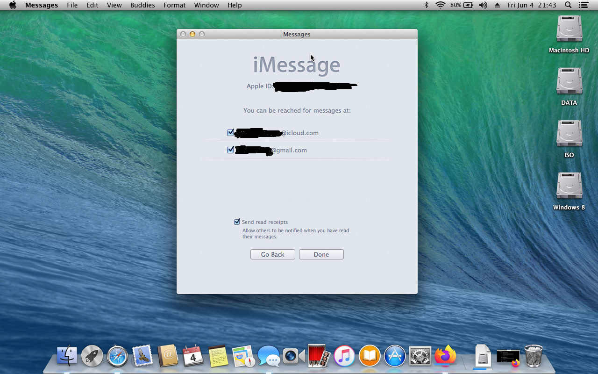

### USB Port
* USB 2.0 is supported by using GenericUSBXHCI.kext.

### Battery
* Using ACPIBatteryManager.kext to have native battery percent.

### Hard Disk
* AHCI_3rdParty_SATA.kext will make your Hackintosh inject all HDD/SSD drive.

### TouchPad
* VoodooPS2Controller.kext will inject and active touchpad.

### Other
* <a href="">Lilu</a>,<a href="">Shiki</a> are these kext which will active Quick Time Player.
* HibernationFixup.kext fix hibernation on your Hackintosh. (Required newest Lilu kext)

## Tool & Tweak
* I also install some kext from 3rd app to make my Hackintosh running better
  * Tick like this on Hackintosh Vietnam Tool

      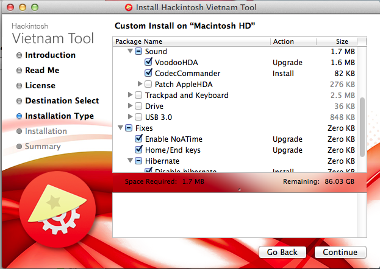

  * Tick like this on Multibeast (HDD user please caution)

      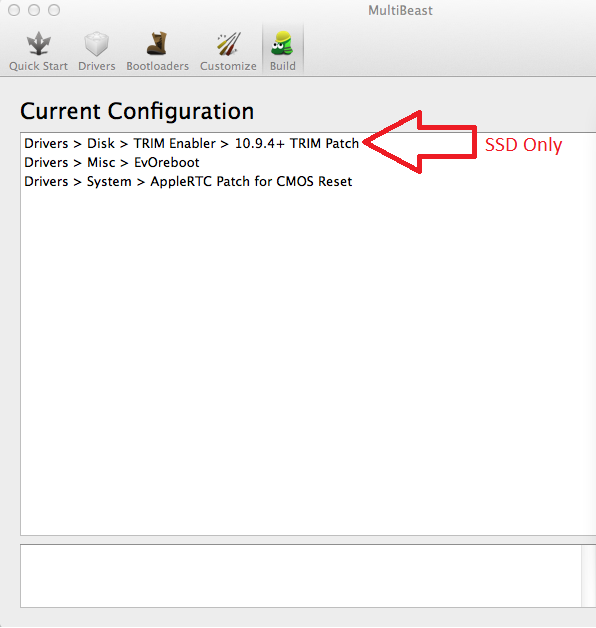

## DSDT & SSDT
* Because iGPU doesn't support and everything is working perfectly. So, i will not patch DSDT and SSDT.

## Chameleon Bootloader
* Just install like this:
  
  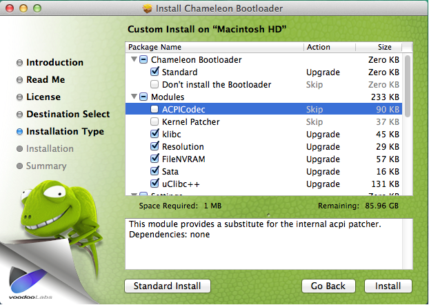

  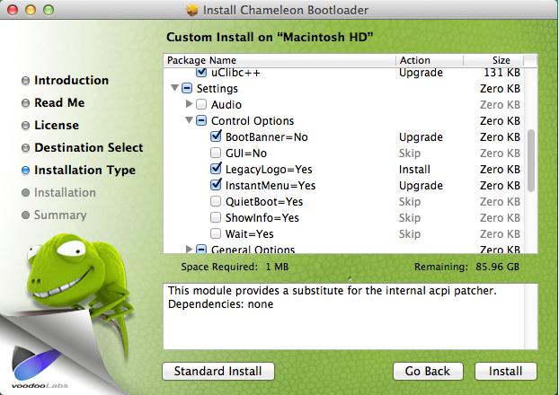

  

  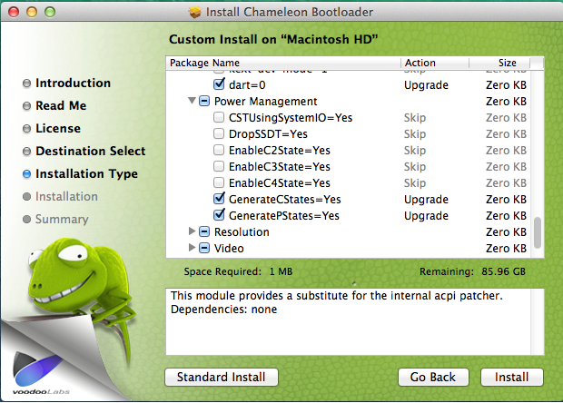

  

  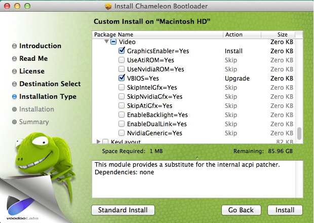

  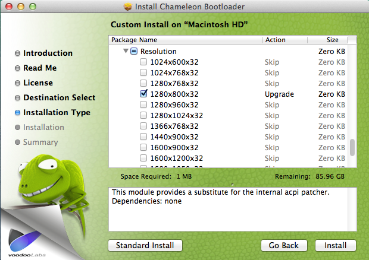

* ⚠ Attention: Please choose resolution if your GPU doesn't support by Apple

## Chameleon Wizard
* You can choose like me or you can custom it for yourself. Here is my Chameleon.Boot.plist

  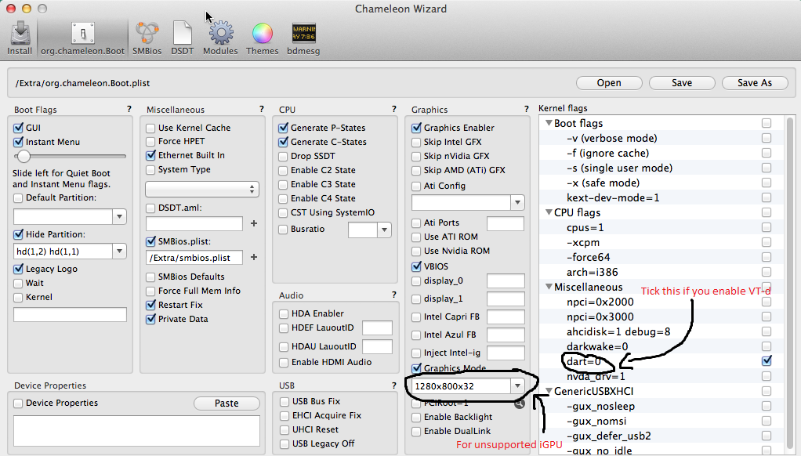

## SMBios
* Custom to MacbookPro7,1 smbios by using Chameleon Wizard.

  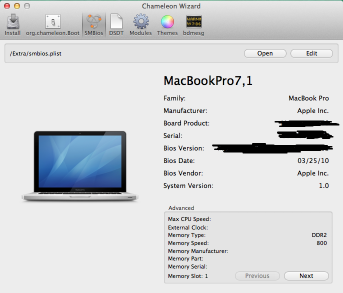

## Issues
* There wasn't any issues with my Hackintosh computer right now.

## Credits
* Apple for MacOS X
* All Hackintosh community

## ⚠ Caution
* All kext for this computer i've uploaded at <a href="https://github.com/red-toxic/Sony-Vaio-VGN-NS240E-Hackintosh/tree/main/Kext">here</a>. Just download it if you want.

* All of these package (Hackintosh Vietnam Tool, Chameleon Bootloader,...) can be find on google, but i've added at <a href="https://github.com/red-toxic/Sony-Vaio-VGN-NS240E-Hackintosh/tree/main/Package">here</a>.

## QuickLook about this mac

	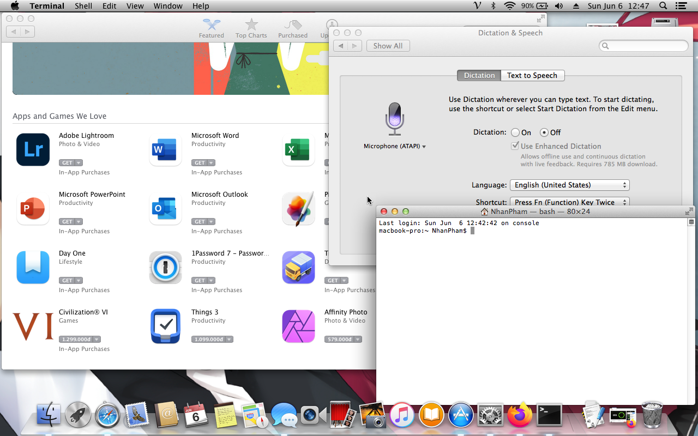

  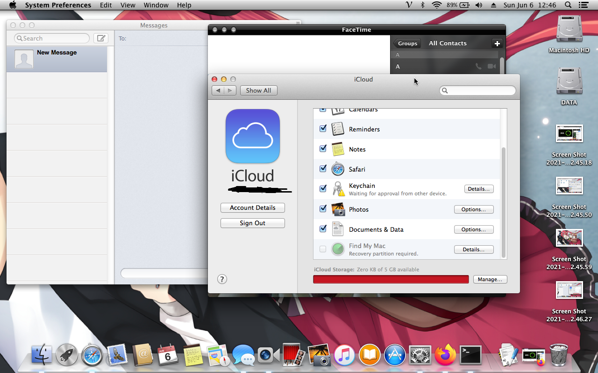

  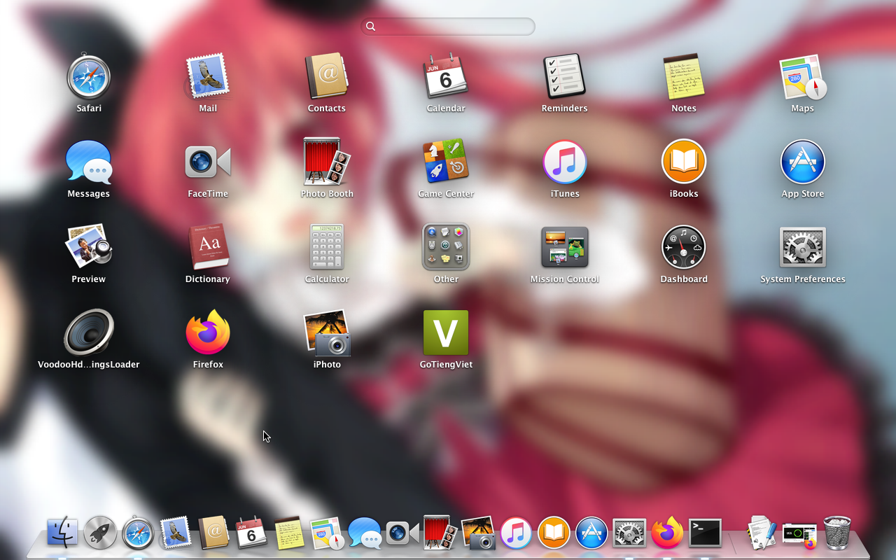

  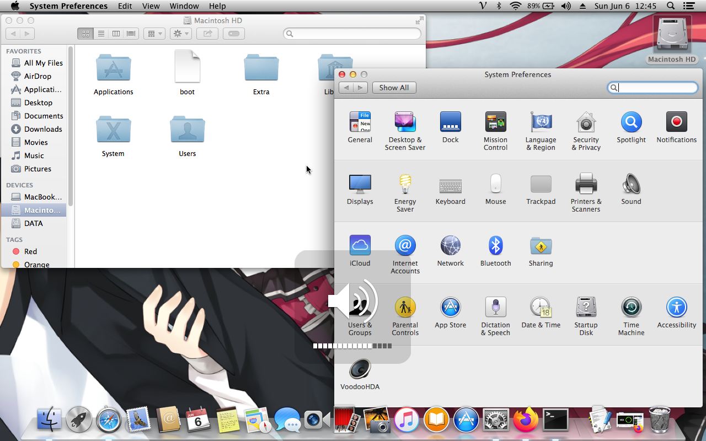

  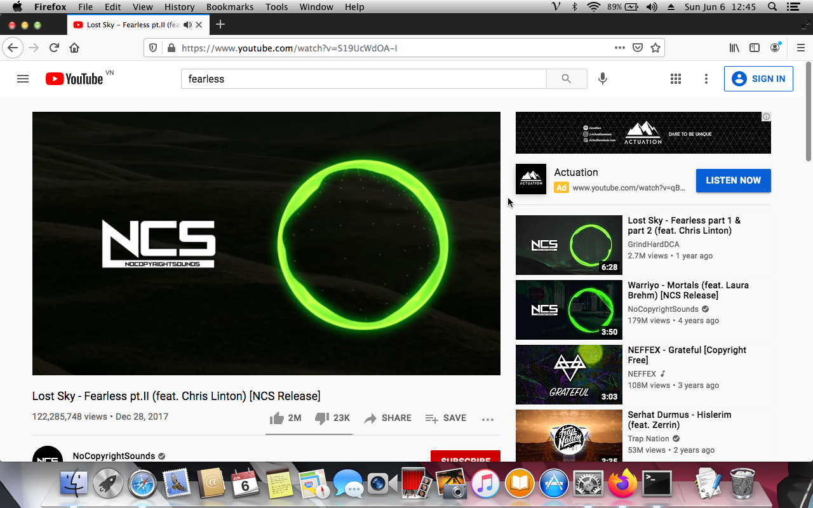

  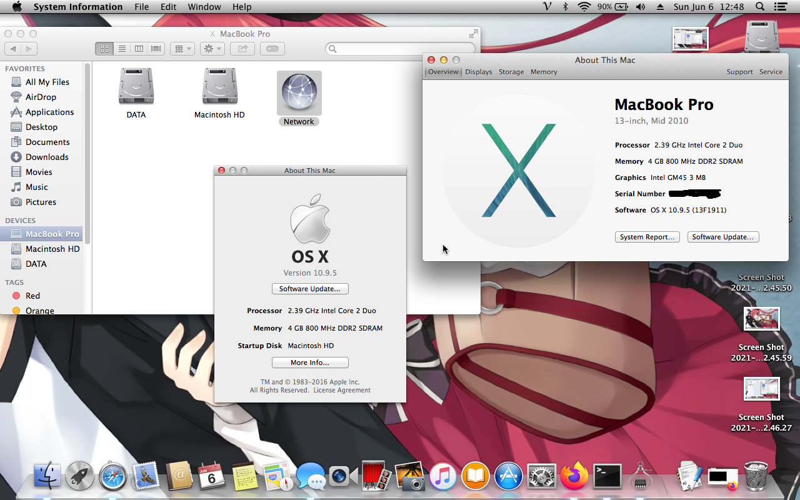

## Follow me
* <a href="https://www.facebook.com/anpk.duyanh/">Facebook</a>