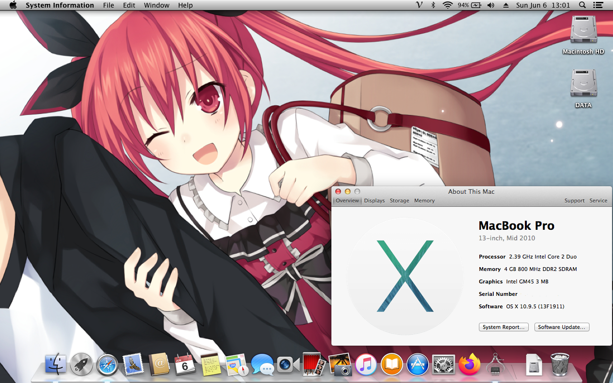

# VGN-NS240E Hackintosh

## ⚠ MacOS X Supported
- Mac OS X: 
  - Snow Leopard ✅
  - Lion ✅
  - Mountain Lion ✅
  - Mavericks ✅
  - Yosemite ✅
- Bootloader: Chameleon Bootloader

## ℹ️ System infomation

  * CPU: Intel(R) Core(TM) 2 Duo CPU T9400 2.54GHz
  * GPU: Mobile Intel(R) 4 Series Express Chipset Family (Intel GM45)
  * Ram: 4GB DDR2 800MHz
  * Hard Disk: Netac SSD 256GB SATA
  *	Optical Drive: SuperMulti DVD Burner
  * Expansion Slot: 1x ExpressCard/34 Slot
  * Port: 4x USB 2.0, 1x 4-Pin FireWire-400, 1x VGA (Output)
  * Display: Widescreen TFT-LCD with XBRITE-ECO Technology 15.4 inch (1280x800)
  * Sound: Realtek 262 (ALC262)
  * Wireless: Atheros 9285 802.11b/g/n
  * Enthernet: Marvell Yukon 88E8055
  * Webcam: Yes
  * Headphone & Speaker: Yes
  * Built-in Microphone: Yes
  * Bluetooth: Yes
  * Battery: Lithium-ion
  * Bios: R1040Y3 (Bios can be update from original WindowsOS)

## ☑️ Status Overview

<strong>Current Status</strong>

### Working

| Feature | Status |
| ------------- | ------------- |
| CPU | ✅ Working |
| GPU | ✅ Working (QE will not work on 10.9+) |
| Fn Key | ✅ Working (Audio only) |
| USB Port | ✅ Working |
| Audio | ✅ Working |
| Battery | ✅ Working |
| TouchPad | ✅ Working |
| Build-in Microphone | ✅ Working |
| Headphone & Speaker | ✅ Working |
| Webcam | ✅ Working |
| Wifi & Bluetooth | ✅ Working |
| Airdrop & Handoff | ✅ Working |
| FileVault | ✅ Working |
| iMessage, Facetime & AppStore | ✅ Working |

### Not Working

| Feature | Status |
| ------------- | ------------- |
| WWAN | ❌ Not Working |
| Ethernet | ❌ Not Working |
| DRM | ❌ Not Working |
| VGA Output | ❌ Not Working |
| Sleep & Wake | ❌ Not Working |
| Brightness | ❌ Not Working | |
| Wifi toggle switch | ❌ Not Working 
| Hibernation | ❌ Not Working |
| SD Card Reader | ❌ Not working |
| Boot Camp Assistant | ❌ Not Working|

## 💾 Bios Config 

  * Intel(R) Virtualization Technology: Disable

## ❓ Issues

### GPU
* Unfortunately, Apple doesn't use Intel GM45 Chipset on their Mac. But luckily, you can custom the resolution from Chameleon Bootloader.

### iMessage/Facetime and App Store
* AppStore will work if you have an internet connection.
* For Facetime & iMessage, follow this <a href="https://github.com/red-toxic/iMessage-Fix/">guide</a>.

  

## Credits
* Apple for Mac OS X
* All Hackintosh community
* Chameleon.osx86.hu for bootloader
* And more...

## QuickLook

  

## Follow me
* <a href="https://www.facebook.com/kleqing24k/">Facebook</a>
* <a href="https://www.twitter.com/kleqing24k">Twitter</a>
