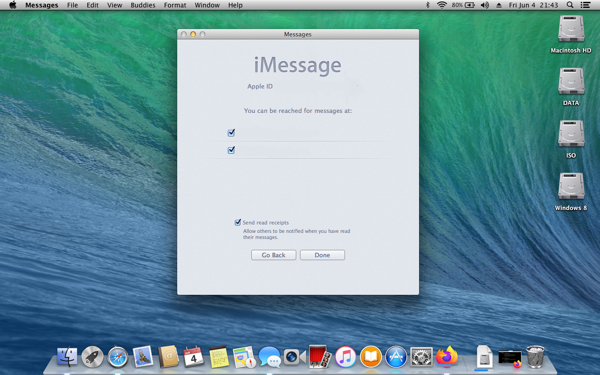

# Sony Vaio VGN-NS240E Hackintosh

## ⚠ MacOS X Supported
- Mac OS X: 
  - Snow Leopard ✅
  - Lion ✅
  - Mountain Lion ✅
  - Mavericks ✅
  - Yosemite ✅ (No QE/CI)
- Bootloader: Chameleon Bootloader

## ℹ️ System infomation

  * CPU: Intel(R) Core(TM) 2 Duo CPU T9400 2.54GHz
  * GPU: Mobile Intel(R) 4 Series Express Chipset Family (Intel GM45)
  * Ram: 4GB DDR2 800MHz
  * Hard Disk: Netac SSD 256GB SATA
  *	Second Hard Disk Drive: Segate HDD 500GB
  * Display: Widescreen TFT-LCD with XBRITE-ECO Technology 15.4 inch (1280x800)
  * Sound: Realtek 262 (ALC262)
  * Wireless: Atheros 9285 802.11b/g/n
  * Enthernet: Marvell Yukon 88E8055
  * Optical Drive: None
  * Webcam: Yes
  * Headphone & Speaker: Yes
  * Built-in Microphone: Yes
  * Bluetooth: Yes
  * Battery: Lithium-ion
  * Bios: R1040Y3 (Bios can be update from original WindowsOS)

## ☑️ Current Status

| Feature | Status |
| ------------- | ------------- |
| CPU | ✅ Working (Not overclocked on T9xx0) |
| GPU | ✅ Working (QE will not work on 10.10) |
| Fn Key | ✅ Working (Audio only) |
| USB Port | ✅ Working |
| Audio | ✅ Working |
| Battery | ✅ Working |
| TouchPad | ✅ Working |
| DRM | ✅ working |
| Build-in Microphone | ✅ Working |
| Headphone & Speaker | ✅ Working |
| Webcam | ✅ Working (It will have a little bit of lag when open an camera app) |
| Wifi & Bluetooth | ✅ Working |
| Airdrop & Handoff | ✅ Working (Handoff working on 10.10 or later) |
| FileVault | ✅ Working |
| iMessage, Facetime & AppStore | ✅ Working |
| VGA Port | ❌ Not Working |
| Sleep & Wake | ❌ Not Working |
| Brightness | ❌ Not Working |
| Hibernation | ❌ Not Working |
| SD Card | ❌ Not working |
| Boot Camp Assistant | ❌ Not Working |
| Wifi toggle switch | ❌ Not Working |

## 💾 Bios Config 
* Config:

  * Tab Advanced:
    * Intel(R) Virtualization Technology: Disable

  * Tab Boot:
    * External Device Boot: Enable
    * Select 1st Boot Priority: External Device

## ✖️ Attention

### GPU
* Unfortunately, Apple doesn't use Intel GM45 Chipset on their Mac. But luckily, insanelymac community had do it by using GMAX3100 kext to fake their GPU.
 * Here is list of MacOS X supported:
   * MacOS X Tiger & Snow Leopard: Native resolution + QE/CI.
   * MacOS X Lion & Mountain Lion: Native resolution + CI. QE work but it have a little bit of lag.
   * MacOS X Mavericks: Custom resolution on Chameleon Bootloader. QE work but it have a little big of lag.
   * MacOS X Yosemite: Apple had fixed. That mean when you custom resolution, QE will not worked.

### Sleep, Wake and Hibernation
* Sleep and Wake doesn't work. I don't know why but when i run this laptop into sleep mode, it will show a black picture and cursor.
* Hibernation will not work on any Hackintosh computer so you shouldn't hope fix this.

### iMessage/Facetime and App Store
* AppStore will work if you have an internet connection.
* For Facetime & iMessage, follow this <a href="https://github.com/red-toxic/iMessage-Fix/">guide</a>.

  

## ☁️ Config (Experimental)

### Tool & Tweak
* I also install some kext from 3rd app to make my Hackintosh running better
  * Tick like this on Hackintosh Vietnam Tool

      

  * Tick like this on Multibeast (HDD user please caution)

      

### Chameleon Bootloader
* I think that it's stability when i config like this. For your laptop/PC, please be careful.
  
  

  

  

  

  

  

  

### Chameleon Wizard
* You can choose like me or you can custom it for yourself. Here is my Chameleon.Boot.plist

  

### SMBios
* Custom to MacbookPro7,1 smbios by using Chameleon Wizard.

  

## ❓ Issues
* There wasn't any issues with my Hackintosh computer right now.
* SSDT/DSDT aren't using on my hackintosh because my hackintosh working stable and don't cause any issue when i using.

## Credits
* Apple for MacOS X
* All Hackintosh community for kext
* Chameleon.osx86.hu for bootloader
* And more...

## ⚠ Caution
* All kext for this computer i've uploaded at <a href="https://github.com/red-toxic/Sony-Vaio-VGN-NS240E-Hackintosh/tree/main/Kext">here</a>. Just download it if you want.

* All of these package (Hackintosh Vietnam Tool, Chameleon Bootloader,...) can be find on google, but i've added at <a href="https://github.com/red-toxic/Sony-Vaio-VGN-NS240E-Hackintosh/tree/main/Package">here</a>.

## QuickLook

  

## Follow me
* <a href="https://www.facebook.com/anpk.duyanh/">Facebook</a>
* <a href="https://www.twitter.com/3xtend3r">Twitter</a>
